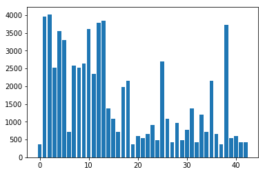
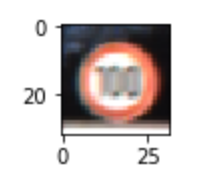
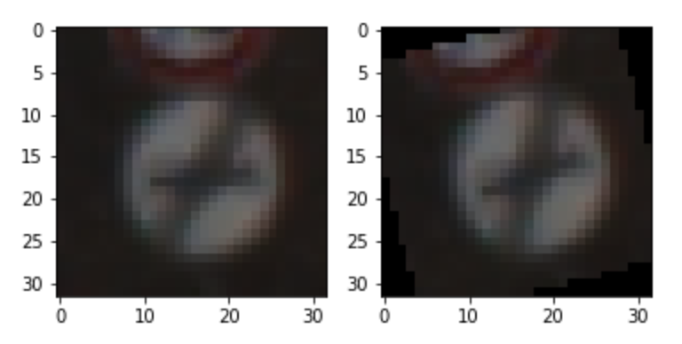
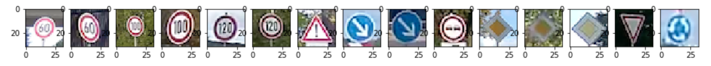

# Project 3 - Traffic Sign Recognition
This project from Udacity‘s Self-Driving Car Engineer Nanodegree program applies deep learning techniques on traffic sign classification. This includes preprocessing the data, build, train and test a neural network model and verify the results from the given dataset with new images.

---
## 1 - Project overview

### Goals:
* Load the data set (see below for links to the project data set)
* Explore, summarize and visualize the data set
* Design, train and test a model architecture
* Use the model to make predictions on new images
* Analyze the softmax probabilities of the new images
* Summarize the results with a written report

### Structure
The whole code can be found in the `Traffic_Sign_Classifier.ipynb` Notebook or in the `report.html` file. The data is saved in the additional `data` folder.
The images data is mainly from the [German Traffic Sign Data Set](http://benchmark.ini.rub.de/?section=gtsrb&subsection=dataset) or from my own dash cam.

---
## 2 - Rubric Points
Here I will consider the [rubric points](https://review.udacity.com/#!/rubrics/481/view) individually and describe how I addressed each point in my implementation.  

### 2.1 - Data Set Summary & Exploration

#### 1. Provide a basic summary of the data set. In the code, the analysis should be done using python, numpy and/or pandas methods rather than hardcoding results manually.

I used basic python and numpy code to calculate summary statistics of the traffic signs data set:

* The size of training set is 34799 images and 69598 with augmented data.
* The size of the validation set is 4410
* The size of test set is 12630
* The shape of a traffic sign image is 32x32x3 (= 32x32 RGB image)
* The number of unique classes/labels in the data set is 43

#### 2. Include an exploratory visualization of the dataset.

Here is an exploratory visualization of the data set. It is a bar chart showing how the data is distributed over the classes.

In addition to that I plotted a random example from the data set:

### Design and Test a Model Architecture

#### 1. Describe how you preprocessed the image data. What techniques were chosen and why did you choose these techniques? Consider including images showing the output of each preprocessing technique. Pre-processing refers to techniques such as converting to grayscale, normalization, etc. (OPTIONAL: As described in the "Stand Out Suggestions" part of the rubric, if you generated additional data for training, describe why you decided to generate additional data, how you generated the data, and provide example images of the additional data. Then describe the characteristics of the augmented training set like number of images in the set, number of images for each class, etc.)

As a first step, I shuffled the training images so the neural network can not be affected by the order of the images. 
Then I converted the images from int8 to float32 as needed by the neural network and for correct normalization. 
As a last step, I normalized the image data by global contrast normalization (GCN) to reduce differences between the images and adjust the data around zero mean and a specific variation. I chose the GCN due to better results in comparison to normal average normalization (verified with the neural network).

I decided to generate additional data because a bigger training set mostly result in a higher accuracy. Besides that, „ConvNets architectures have built-in invariance to small translations, scaling and rotations.“ ([Sermanet & LeCun 2](http://yann.lecun.com/exdb/publis/pdf/sermanet-ijcnn-11.pdf)). Because of this I decided to add a rotated copy for each image in the training set with random angle.
Here is an example of an original image (left) and an augmented image (right):

The difference between the original data set and the augmented data set is that there are twice as much training images as in the original data set.

#### 2. Describe what your final model architecture looks like including model type, layers, layer sizes, connectivity, etc.) Consider including a diagram and/or table describing the final model.

My final model (convolutional neural network, modified LeNet) consists of the following layers:

| Layer         		|     Description	        					| 
|:---------------------:|:---------------------------------------------:| 
| Input         		| 32x32x3 RGB image   						| 
| Convolution 	| 1x1 stride, valid padding, outputs 28x28x6 	|
| RELU 			| 											|
| Max pooling	| 2x2 stride, valid padding, outputs 14x14x6 	|
| Convolution 	| 1x1 stride, valid padding, outputs 10x10x16      	|
| RELU 			| 											|
| Max pooling	| 2x2 stride, valid padding, outputs 5x5x6 		|
| Flattening		| Outputs 400								|
| Fully contected	| Outputs 120								|
| RELU 			| 											|
| Dropout		| Keep probability train: 0.5, validate/test: 1		|
| Fully contected	| Outputs 84									|
| RELU 			| 											|
| Fully contected	| Outputs 43 (number of classes)				|

Original LeNet Architecture by Yann LeCun from [original paper](http://yann.lecun.com/exdb/publis/pdf/lecun-01a.pdf)

#### 3. Describe how you trained your model. The discussion can include the type of optimizer, the batch size, number of epochs and any hyperparameters such as learning rate.

To train the model, I used an AdamOptimizer combined with a softmax cross entropy. The AdamOptimizer has been designed specifically for training deep neural networks. The advantages of the AdamOptimizer are that it combines the gradient decent method with adaptive learning rate optimization. This results in individual learning rates for each weight and better end results.
For better performance I splitted the data sets into batches of size 128 which worked quite well. The number of epochs is chosen also quite default with 10. In the training results you can see that the CNN learns from each epoch and increase accuracy. I chose the learning rate quite low with 0.001 as a starting point for the AdamOptimizer.

#### 4. Describe the approach taken for finding a solution and getting the validation set accuracy to be at least 0.93. Include in the discussion the results on the training, validation and test sets and where in the code these were calculated. Your approach may have been an iterative process, in which case, outline the steps you took to get to the final solution and why you chose those steps. Perhaps your solution involved an already well known implementation or architecture. In this case, discuss why you think the architecture is suitable for the current problem.

My final model results were:
* training set accuracy of 99.7%
* validation set accuracy of 96.4% (best throughout all tests: 96.9%)
* test set accuracy of 95.2%

I chose the LeNet architecture because it performes well on optical character recognition. Traffic signs are mainly pictograms which are quite similar to letters. They differ in shape, color and orientation like letters.
When I first trained my network I was confused by the horrible bad performance (1-2% accuracy) that turned out to be a result of wrong normalization (the int to float conversion). After fixing this I almost hit 90% accuracy with the vanilla LeNet architecture and original data set. In addition to that I added an extra dropout layer after the first fully connected layer which resulted in the final results with the augmented data (and about 94% with the original image set). The high accuracies on training, validation and test sets prove that the model works really good (even on images not included in the data set).

### Test a Model on New Images

#### 1. Choose five German traffic signs found on the web and provide them in the report. For each image, discuss what quality or qualities might be difficult to classify.

I took 15 traffic signs from my dash cam videos from my last trip to Berlin:

The third and the 12th image might be difficult to classify because of the blurred traffic signs on it.

#### 2. Discuss the model's predictions on these new traffic signs and compare the results to predicting on the test set. At a minimum, discuss what the predictions were, the accuracy on these new predictions, and compare the accuracy to the accuracy on the test set

Here are the results of the prediction:

| Index  | Image Class | Prediction | Certainty of prediction |
|:------:|:---------------------:|:---------------------------------------------:|:------:| 
|1| 60km/h      		| Correct   		| 99.996%	|	 
|2| 60km/h      		| Correct   		| 99.723%	|	 
|3| 100km/h      		| FALSE (Yield)	| 81.838%	|	 
|4| 100km/h      		| Correct   		| 88.299%	|	 
|5| 120km/h      		| Correct   		| 99.959%	|	 
|6| 120km/h      		| Correct   		| 100%	|	 
|7| General caution	| Correct   		| 100%	|	 
|8| Keep right      		| Correct   		| 100%	|	 
|9| Keep right      		| Correct   		| 100%	|	 
|10| No passing    		| Correct   		| 100%	|	 
|11| Priority road  		| Correct   		| 100%	|	 
|12| Priority road  		| Correct   		| 100%	|	 
|13| Priority road		| Correct   		| 99.998%	|	 
|14| Yield	      		| Correct   		| 100%	|	 
|15| Roundabout 		| Correct   		| 100%	|	 

The model was able to correctly guess 14 of the 15 traffic signs, which gives an accuracy of 93.3%. This compares favorably to the accuracy on the test set of 95.2%.
As already expected the third image was classified wrong. This could be the result of the bad readability of the number 100. Noteworthy is the correct classification of the 12th image.

#### 3. Describe how certain the model is when predicting on each of the five new images by looking at the softmax probabilities for each prediction. Provide the top 5 softmax probabilities for each image along with the sign type of each probability.

The code for making predictions on my final model is located in the 19th cell of the Ipython notebook.

Due to the very high prediction certainties for nearly all images (~100%) I will just discuss the wrongfully qualified image. The top five soft max probabilities were

| Probability         	|     Prediction	        					| 
|:---------------------:|:---------------------------------------------:| 
| 81.84%         | Yield   		| 
| 16.31%     	| 50km/h		|
| 0.005%		| Keep right	|
| 0.003%		| 70km/h		|
| 0.003%		| Go straight or left |

The 100km/h class does not appear in this table. Again, this could be the result of the bad readability of the number 100.
